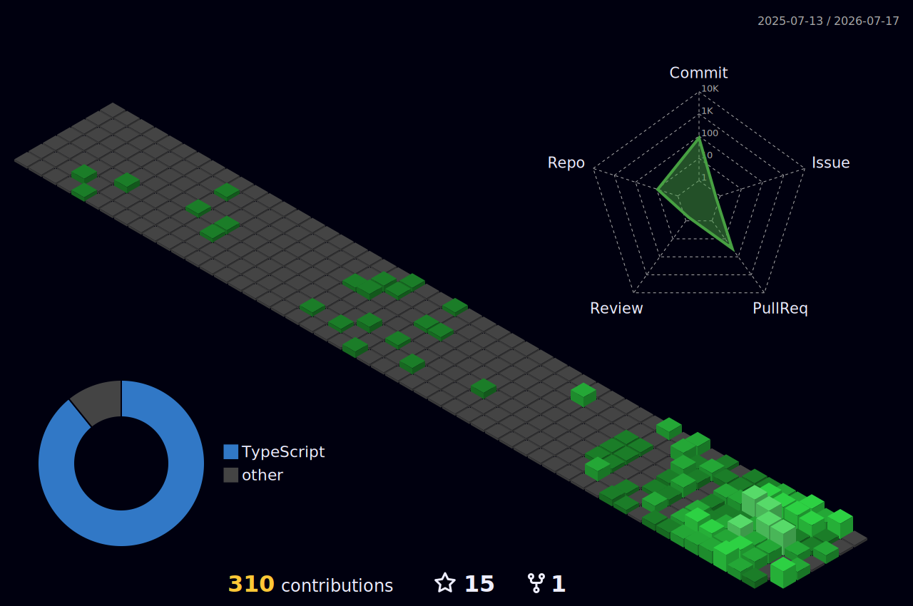

<!--
  ════════════════════════════════════════════════════════════════
  SETUP CHECKLIST (invisible on GitHub — delete when done)
  1. Username is set to "ishanwadhwani" everywhere. Change if needed.
  2. STATS CARD + TOP LANGS: still need your self-hosted instance
     (see the github-readme-stats note in the stats section).
  3. 3D CONTRIBUTIONS: add the workflow file .github/workflows/profile-3d.yml
     (provided separately). It auto-generates the SVG daily.
  4. CHESS GAME: copy the workflow + assets from github.com/timburgan/timburgan
     (steps in the ./play.sh section below).
  5. Portfolio link guessed as ishanwadhwani.dev — fix if wrong.
  ════════════════════════════════════════════════════════════════
-->


<div align="center">


<p>
  <a href="mailto:iwadhwani029@gmail.com"></a>
  <a href="https://linkedin.com/in/ishan-wadhwani"></a>
  <a href="https://ishanwadhwani.dev"></a>
  
</p>

</div>

## `$ whoami`

```bash
$ whoami
→ ishan — data engineer by day, product builder by night

$ ishan --stack
→ typescript · next.js · node · python · snowflake

$ ishan --current-quest
→ [████████░░] shipping CashFlow Command 🚀  (GST SaaS for Indian SMBs)

$ ishan --uptime
→ since 2024 @ accenture · pipeline_errors -90% · dev_time -70%

$ ishan --status
→ 🟢 online · building cool things · ☕ coffee.level = critical
```

> **TL;DR** — I turn SQL chaos into shipped software. Snowflake-centric data pipelines
> by day (Accenture, client: BHP), full-stack products by night. **SnowPro Core Certified.**

## `$ cat tech-stack.json`

<div align="center">

`languages`


`frameworks`


`data & cloud`


`tools`


</div>

## `$ ls -la ~/projects`

```bash
drwxr-xr-x  ishan  staff   cashflow-command/   # GST invoicing & cashflow SaaS — Indian SMBs
drwxr-xr-x  ishan  staff   depense/            # group expense tracker + bill splitting
drwxr-xr-x  ishan  staff   invoice-generator/  # single-session invoicing, live preview
```

| Project | What it does | Stack |
|---|---|---|
| **[CashFlow Command](https://github.com/ishanwadhwani)** | GST-compliant invoicing & cashflow SaaS — invoices, expenses, payroll, vendor bills & GST reporting. | `Next.js 14` `TypeScript` `Express` `Prisma` `Postgres` |
| **[Depense](https://github.com/ishanwadhwani/depense)** | Personal & group expense tracker with bill-splitting for shared costs. | `Next.js` `TypeScript` `Express` `Prisma` `Postgres` |
| **[Invoice Generator](https://github.com/ishanwadhwani/invoice-generator)** | Single-session invoicing with live preview — cut repeat-user form time by **60%**. | `Next.js` `TypeScript` `Node` `Postgres` |

<div align="center">


</div>

## `$ git log --stat`

<div align="center">

<!-- ⬇️ YOUR STATS BLOCK — kept exactly as you set it -->


<br/><br/>


<br/><br/>

<!-- ⬇️ NEW: contribution activity graph (themed green) -->


</div>

## `$ render --3d ./contributions`

<div align="center">

<!--
  Needs the workflow .github/workflows/profile-3d.yml (provided separately).
  After its first run it commits the SVG below. Until then this image is broken — that's expected.
-->


<br/><br/>

<div align="center">

<a href="mailto:iwadhwani029@gmail.com"></a>

<br/>

`// turning SQL chaos into shipped software`

</div>


<!--
  OPTIONAL contribution-snake (extra hacker flair):
  add .github/workflows/snake.yml using Platane/snk, then uncomment:
  
-->
